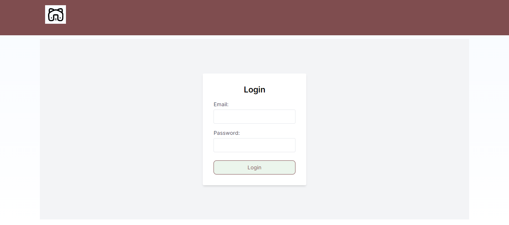
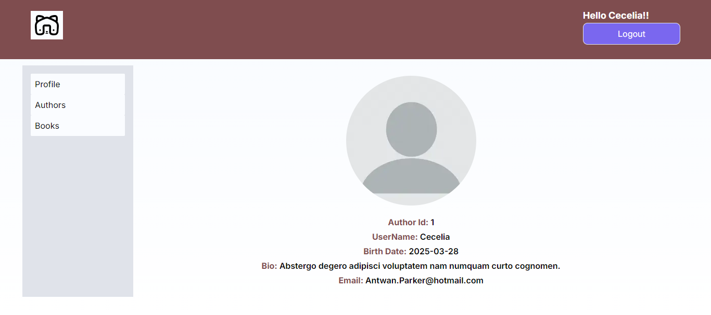
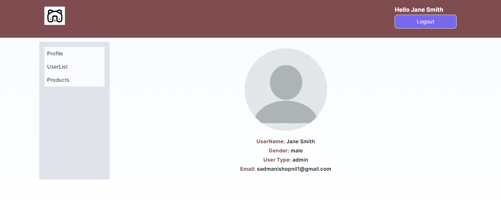
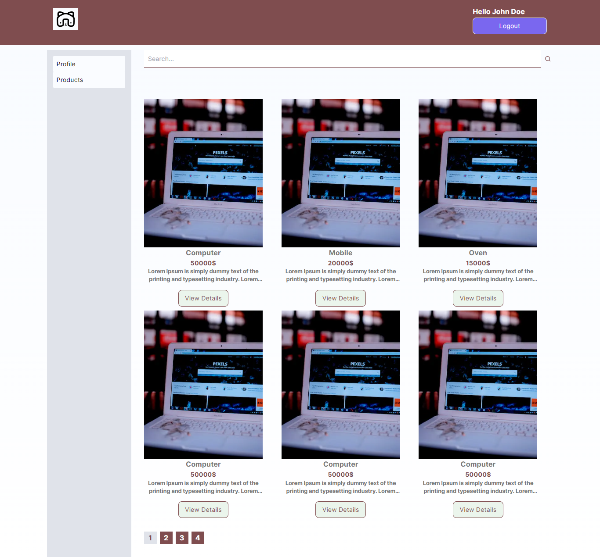
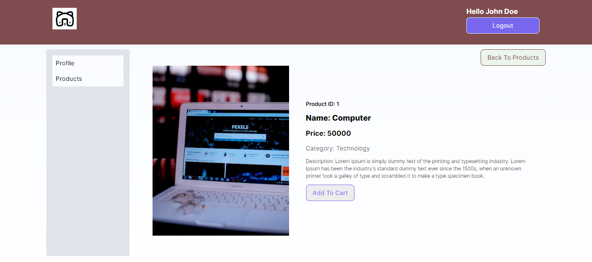
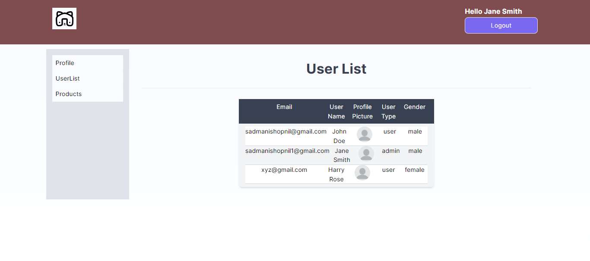

## Key Technologies

**Client-Side:** Next js, TailwindCSS

**Language:** TypeScript

**Test**: Jest

**Documentation**: Lucidchart

## Demo

- **Login page**
  

- **Profile page of User**
  

- **Profile page of Admin**
  

- **All Product Page**
  

- **Single Product Page**
  

- **User List Page**
  

## Run Locally

Clone the project

```bash
  git clone https://github.com/SYShopnil/ATPL-Task.git
```

Go to the project directory

```bash
  cd
  ATPL-Task
```

Install dependencies

```bash
  npm install || npm i
```

Start the server

```bash
  npm run dev
```

Start the Test

```bash
  npm run test
```

## Support

For support, sadmanishopnil@gmail.com
