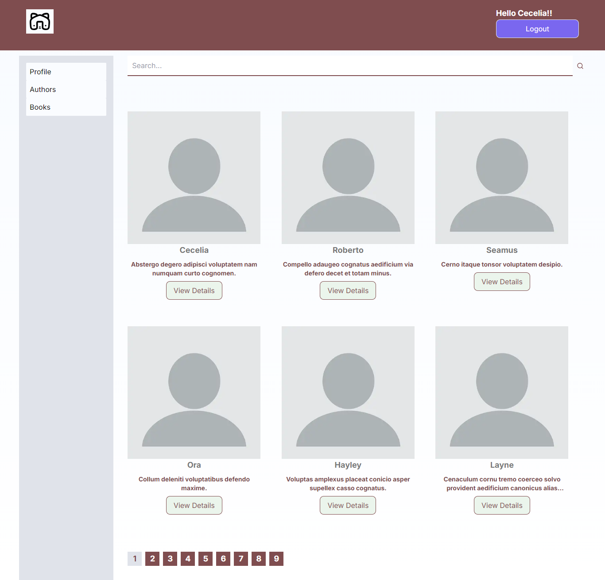
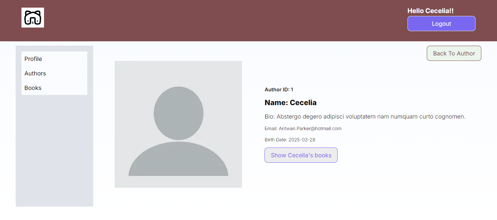
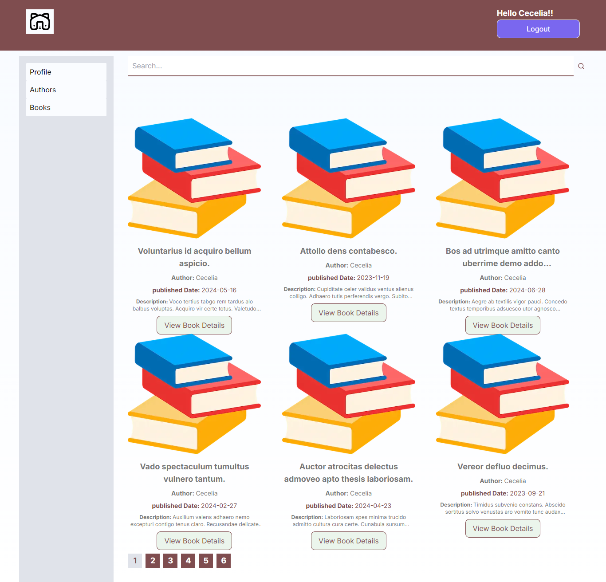
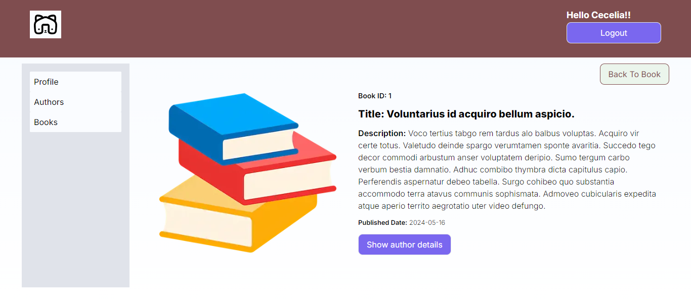

## Key Technologies

**Client-Side:** Next js, TailwindCSS

**Language:** TypeScript

**Test**: Jest

## Demo

- **Login page**
  

- **Profile page of User**
  

- **All Author Page**
  

- **Single Author Page**
  

- **All Book Page**
  

- **Single Book Page**
  

## Run Locally

Clone the project

```bash
  git clone https://github.com/SYShopnil/m360ict-book-library-task.git
```

Go to the project directory

```bash
  cd
  m360ict-book-library-task
```

```bash
  cd
  view
```

Install dependencies

```bash
  npm install || npm i
```

Start the server

```bash
  npm run dev
```

Start the Test

```bash
  npm run test
```

## Support

For support, sadmanishopnil@gmail.com
